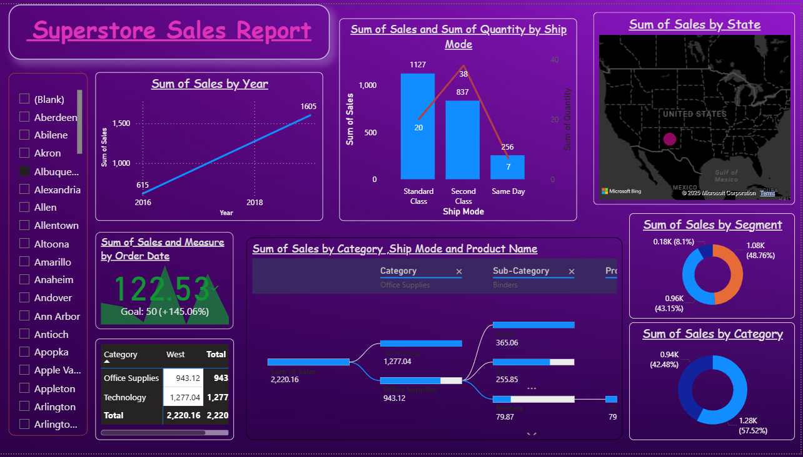

# 📦 Superstore Sales & Profit Analysis Across the USA

This project involves end-to-end analysis of sales and profit data from a fictitious Superstore retail company operating across the United States. Using **Power BI**, **Excel**, and **SQL**, we uncover insights on regional performance, product profitability, customer segments, and market trends.

---

---

## 🎯 Objective

To analyze Superstore's historical sales data and deliver business insights using interactive dashboards. This helps stakeholders understand:

- Which regions/states contribute most to sales and profit
- Which products and categories are underperforming
- Key customer segments driving revenue
- Seasonal trends and shipping performance

---

## 📁 Dataset

- 📂 **Source**: Sample Superstore dataset (CSV format)
- 🧾 **Records**: 9,994 transactions
- 📌 **Fields** include:  
  `Order Date`, `Sales`, `Profit`, `Category`, `Region`, `Customer Segment`, `Ship Mode`, `State`, `Discount`, etc.

---

## 🔧 Tools & Technologies Used

| Tool        | Purpose                            |
|-------------|-------------------------------------|
| **Power BI** | Data visualization and KPI dashboard |
| **Excel**    | Data cleaning and exploration       |
| **SQL**      | Custom queries and filtering logic  |

---

## 🧠 Key KPIs

These KPIs were tracked and visualized using Power BI:

- 💵 **Total Sales**
- 📈 **Total Profit**
- 📊 **Profit Margin (%)**
- 📍 **Top Performing States**
- 📦 **Sales by Product Category & Subcategory**
- 🧍‍♂️ **Sales by Customer Segment**
- 🗓️ **Sales Trend Over Time**
- 🚚 **Shipping Mode Performance**

---

## 📊 Dashboard Highlights

- 🗺️ **Map Visual** showing state-wise profit and loss
- 🧩 **Category/Subcategory Breakdown** with profit contribution
- 📆 **Time Series Graph** for monthly sales and profit trend
- 📉 **Top 10 Loss-Making Products**
- 🧍 **Segment-wise Revenue Distribution**
- 🎯 **Dynamic Filters** by Region, Year, and Category

---

## 🔍 Insights Derived

- 📉 The **Southern region** had lower overall profit due to heavy discounting.
- 🛋️ **Furniture** category often results in losses despite high sales.
- 💼 **Corporate customers** contribute the highest profit margin.
- 🚚 **Standard Class** shipping is the most used mode but has lower profit efficiency.

---

## 📌 Project Outcomes

- 📢 Improved understanding of **regional and category performance**
- 📋 Delivered a **Power BI Dashboard** for stakeholder decision-making
- 🧠 Identified **actionable insights** to optimize discounts and shipping

---

## 🚀 How to Run This Project

1. Clone or download the repository
2. Open `Superstore Dataset.csv` in Power BI or Excel
3. Open the `.pbix` Power BI file to explore the visuals
4. Filter and interact with the dashboard

---

## 📎 Screenshots

> *(Add images of your Power BI dashboard here if hosted)*  
> Example:  
> 

---

## 🙋‍♂️ Author

**Venkata Sai Krishna**  
📊 Data Analyst | Power BI Developer  
🔗 [LinkedIn](https://www.linkedin.com/in/venkat-sai-928b741b7)  
📧 your_email@gmail.com

---

> _"Data is the new oil, but insight is the combustion engine."_

